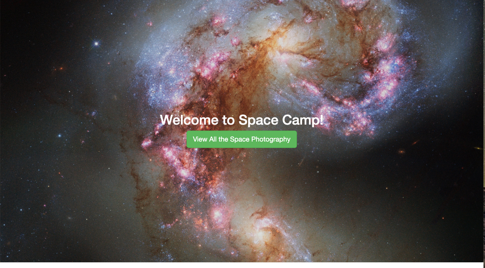
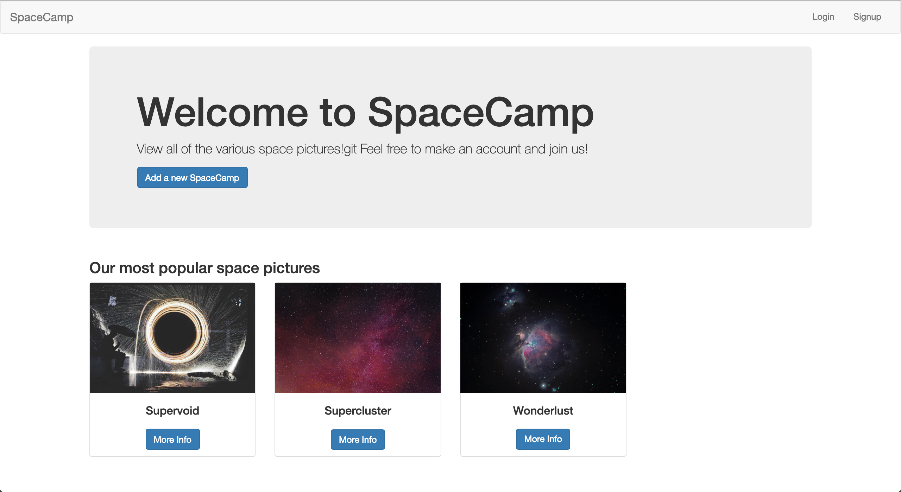
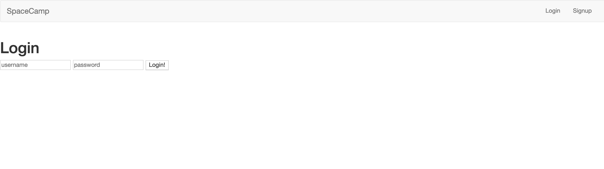
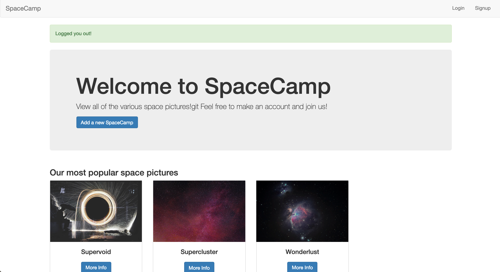
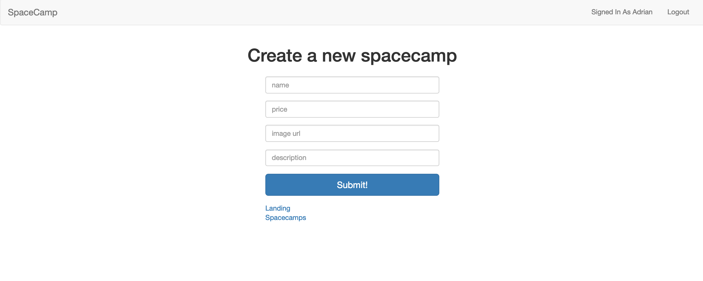
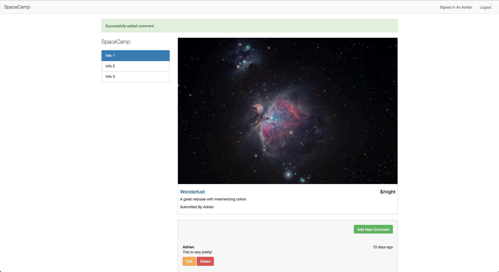

# SpaceCamp
This is a web application done with Node.js.

The link to the website can be found [here](https://nameless-crag-28715.herokuapp.com/). If you would like to run it on a local server, follow the next instructions.

## Presentational Images
The following section will present some images of the website

##### Landing Page

##### Langing Page Sample 2

##### Home Page

##### Login Page

##### Succesful Login Page With Dynamic User

##### Create Page

##### Show Page


## Getting Started
To install the application in your local machine, follow the next steps.

  1. Navigate to a directory of your choosing; this is where your application will be installed. 
  
  2. Clone the repository by running ``` git clone webUrl ``` on your bash, where *webUrl* is the Https hyperlink found in the    *Clone or Download* button.

  3. Get inside the created folder, and run ``` npm install ``` to install the node dependencies onto your local machine.
  
  4. One that is done, you can run ``` npm start ```, and the application will run on your local server.


